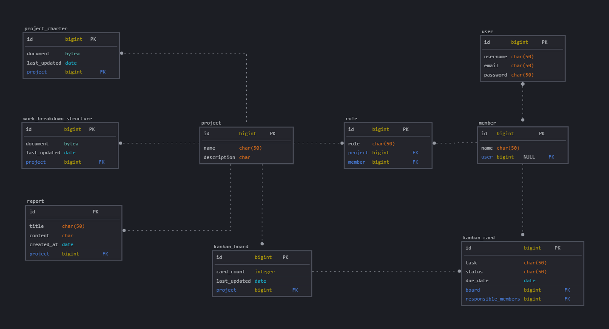

# ProjectManager.ai
AI powered project management app

# pip Packages:
1. django
2. djangorestframework
3. django-cors-headers
4. djangorestframework-simplejwt
5. email-validator  
6. PyPDF2
7. google-genai
8. dotenv
```pip install django djangorestframework django-cors-headers djangorestframework-simplejwt email-validator PyPDF2 google-genai dotenv```

# npm Packages:
1. vite@6 
2. @tailwindcss/vite 
3. tailwindcss
4. daisyui@latest  
5. axios
```npm install```

# Database Schema:


# Routes: